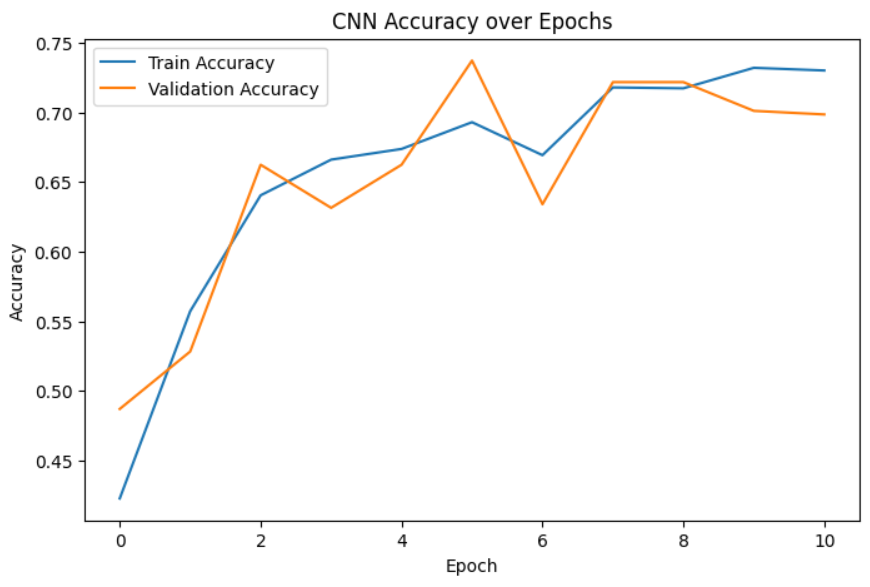
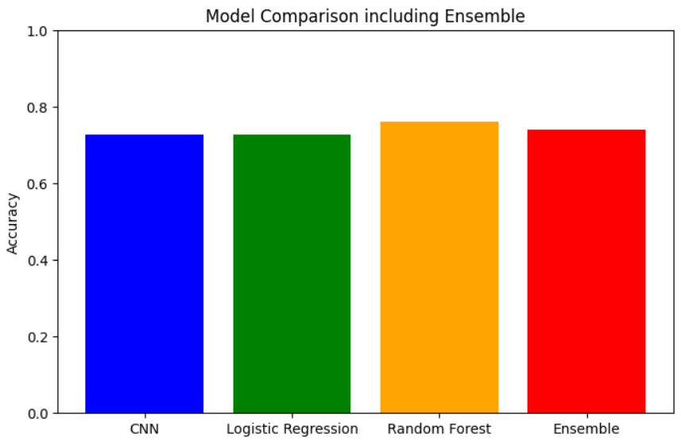
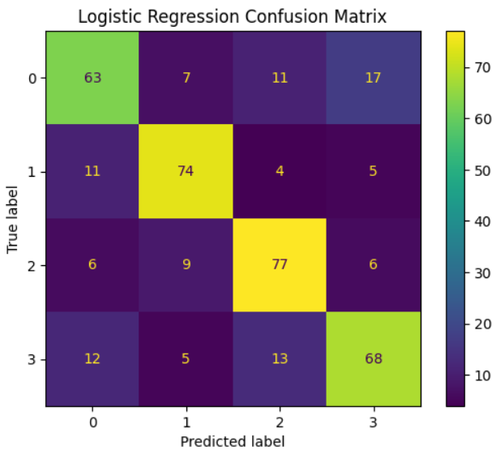
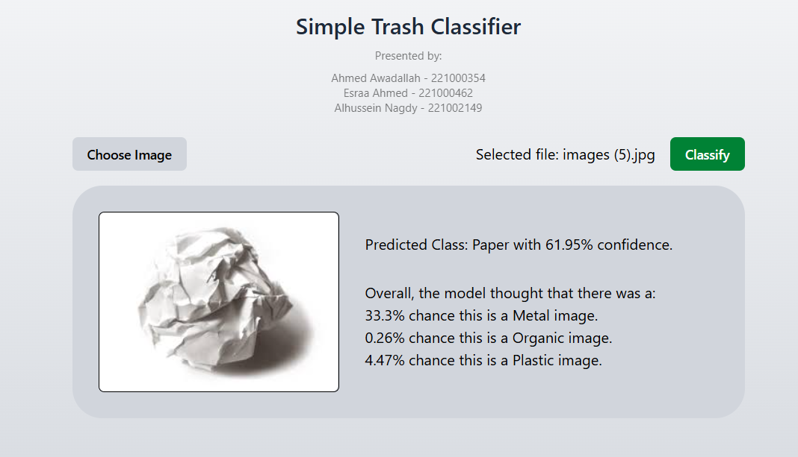
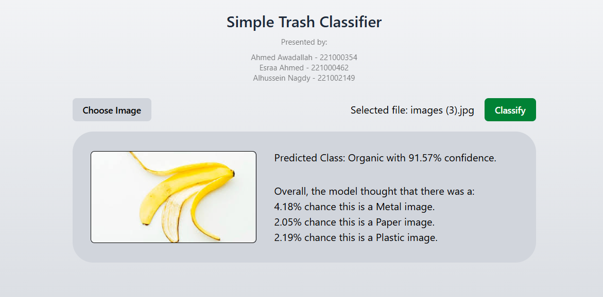

# Trash Classifier: Machine Learning Image Classifier

# Presented and made by:

Ahmed Awadallah - 221000354

Esraa Ahmed - 221000462

Alhussein Nagdy - 221002149

## Overview:

This project implements a machine learning pipeline for classifying images of trash into four categories: **metal, organic, paper, and plastic**. It uses a combination of deep learning (CNN) and classical ML models (Logistic Regression and Random Forest) gathering them in a soft voting ensemble to (somewhat) improve classification performance. The backend exposes a **FastAPI endpoint** for image uploads and predictions.

---

## Mechanisms:

### Part 1: Dataset & Preprocessing

- The dataset is scraped from DuckDuckGo using `ddgs` and organized into folders corresponding to the four classes: `metal`, `organic`, `paper`, `plastic`.
- Images are loaded using `ImageDataGenerator` with:
  - Rescaling
  - Augmentation: rotation, width/height shifts, horizontal flips
  - Train/validation split (80/20)
  - Object-contain resizing to `(128,128)`

Example:

```python
train_datagen = ImageDataGenerator(
    rescale=1./255,
    rotation_range=20,
    width_shift_range=0.2,
    height_shift_range=0.2,
    horizontal_flip=True,
    validation_split=0.2
)
```

---
## Part 2: CNN Model

A sequential CNN with 3 convolutional layers, max-pooling, flattening, and fully connected layers.

Dropout is used to reduce overfitting.

Output layer uses softmax for the 4 classes.

Trained with early stopping on validation accuracy.

```python
cnn_model = models.Sequential([
    layers.Conv2D(32, (3,3), activation='relu', input_shape=(128,128,3)),
    layers.MaxPooling2D(2,2),
    layers.Conv2D(64, (3,3), activation='relu'),
    layers.MaxPooling2D(2,2),
    layers.Conv2D(128, (3,3), activation='relu'),
    layers.MaxPooling2D(2,2),
    layers.Flatten(),
    layers.Dense(128, activation='relu'),
    layers.Dropout(0.5),
    layers.Dense(4, activation='softmax')
])
```

---
## Part 3: Classical Models

Logistic Regression and Random Forest are trained on **CNN-extracted features** rather than raw flattened images. This allowed the classical models to leverage the semantic information learned by the CNN, which improved the overall performance.

---

## Part 4: Soft Voting Ensemble

- CNN predictions are weighted 0.25, Logistic Regression 0.25, Random Forest 0.5.
- Final predicted class and confidence are returned by averaging their class probabilities, and then utilized in the frontend as well.

---

## Part 5: Model Persistence

Models are saved to be used in the API:

```python
cnn_model.save("models/cnn_model.keras")
joblib.dump(log_model, "models/log_model.pkl")
joblib.dump(rf_model, "models/rf_model.pkl")
```

---

## Part 6: Backend API

The backend is a FastAPI service that accepts image uploads via a `POST /classify` endpoint, processes the image into a normalized NumPy array, and runs predictions through a CNN, Logistic Regression, and Random Forest. A soft voting ensemble combines these predictions if necessary to produce a final predicted class and confidence. The API returns a JSON response (as seen in the Output Format below) containing the predicted class, confidence score, and probabilities for all classes and returns it.

---

## Part 7: Frontend & Deployment

The frontend is built with React, providing an interface to analyze one image, run it through the backend, then display the results of the classification. It shows the confidence and what the model also thought about the other classifications.

The backend is deployed on Railway, while the frontend is hosted on Vercel. The two are connected so that the frontend can make API requests to the live backend endpoint.

---
## Input Format

Single image file uploaded via FastAPI POST request.

---
## Output Format

JSON containing:
- `predicted_class`
- `confidence` (0-1)
- `all_probs` (dictionary of probabilities for all classes)

Example:

```json
{
  "predicted_class": "plastic",
  "confidence": 0.87,
  "all_probs": {
    "metal": 0.02,
    "organic": 0.05,
    "paper": 0.06,
    "plastic": 0.87
  }
}
```

---
## Programming Language, Tools & Libraries

- **API Development:** FastAPI, Pydantic, Uvicorn, python-multipart
- **Machine Learning & Data Processing:** TensorFlow/Keras, scikit-learn, numpy, pandas, Pillow
- **Visualization:** matplotlib
- **Model Persistence:** joblib
### Frontend & Visualization: Javascript
- React (TypeScript)
- ShadCN for UI components
- Tailwind CSS for styling
---
## Metrics




---

## Screenshots


